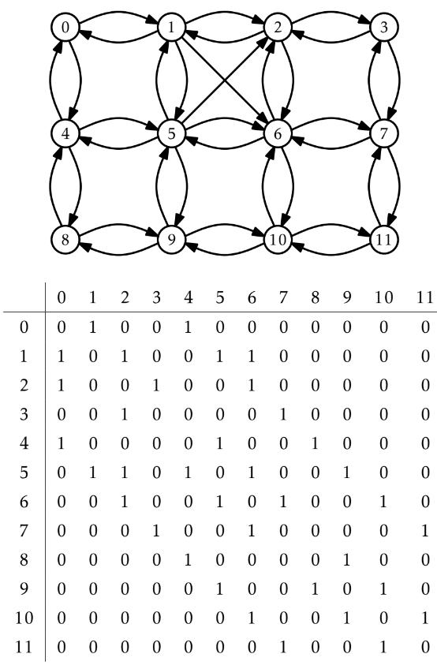
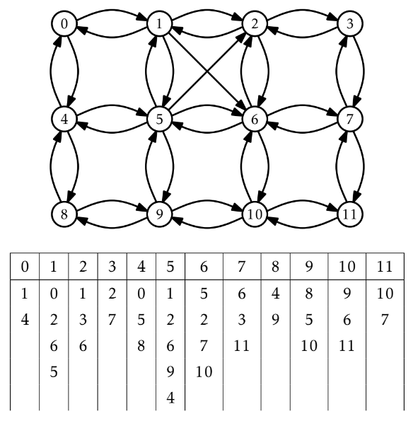

# 12.グラフ（有向グラフ）

## 有向グラフとは


頂点の列をv<sub>0</sub>, ..., v<sub>k</sub>としたとき  
- **経路** : 任意のi(0, ..., k)について辺(v<sub>i-1</sub>, v<sub>i</sub>)が*E*に含まれる場合、v<sub>0</sub>, ..., v<sub>k</sub>を経路という。
- **循環** : (v<sub>k</sub>, v<sub>0</sub>)も*E*に含まれるとき
- **単純** : v<sub>0</sub>, ..., v<sub>k</sub>が互いに異なるとき

## グラフインターフェースの操作
|操作名 |説明 |
|:----|:----|
|**addEdge(i, j)** | 辺(i, j)をEに加える。|
|**removeEdge(i, j)** | 辺(i, j)をEから除く。|
|**hasEdge(i, j)** | 辺(i, j)がEに含まれるか調べる。|
|**outEdges(i)** | 始点がiの辺の終点jのリストを返す。|
|**inEdges(i)** | 終点がiの辺の始点jのリストを返す。|

## グラフインターフェースの実装
#### AdjacencyMatrix
- 隣接行列でグラフを表現する。
- n<sup>2</sup>の行列のためメモリ使用量が大きい。

#### AdjacencyList
- 隣接リストでグラフを表現する。

### 各実装の実行時間
|操作名 |AdjacencyMatrix |AdjacencyList |
|:----|:---:|:----:|
|**addEdge(i, j)**    |O(1)|O(1)     |
|**removeEdge(i, j)** |O(1)|O(deg(i))|
|**hasEdge(i, j)**    |O(1)|O(deg(i) |
|**outEdges(i)**      |O(n)|O(deg(i) |
|**inEdges(i)**       |O(n)|O(n+m)   |
※頂点の個数をn, 辺の個数をm  


## 12.1 グラフの実装① AdjacencyMatrix
- n 個の頂点を持つグラフ G = (V ,E) を、真偽値を並べた n× n 行列 a を使って表現する。  
  
  
  
行列a<sup>2</sup>で, i から j への(中間頂点 k を通る)経路のうち、長さがちょうど 2 であるものの個数が分かる。

## 12.2 グラフの実装③ AdjacencyList
- グラフ G = (V ,E) を、リストの配列 adj で表現する。
- adj[i] は、(i,j) ∈ E を満たすすべての添字 j からなるリストである。



## グラフの走査
教科書では、頂点iから開始して、i から到達可能なすべての頂点を探索するアルゴリズムを 2 つ紹介。
### 幅優先探索（bfs）
- 頂点 i から開始し、i に隣接する頂点、i の隣の隣、i の隣の隣の隣、という順番で訪問していく。
- すでに訪問した頂点をseenで管理する。
```cpp
void bfs(Graph &g, int r) {
    bool *seen = new bool[g.nVertices()];
    SLList<int> q;
    q.add(r);
    seen[r] = true;
    while (q.size() > 0) {
        int i = q.remove();
        ArrayStack<int> edges;
        g.outEdges(i, edges);
        for (int k = 0; k < edges.size(); k++) {
            int j = edges.get(k);
            if (!seen[j]) {
                q.add(j);
                seen[j] = true;
            }
        }
    }
    delete[] seen;
}
```
### 深さ優先探索
- 二分木の深さ優先探索と似ている。
- 頂点を色c[i]で管理。未訪問: white, 訪問中: grey, 訪問済: black  
```cpp
void dfs2(Graph &g, int r) {
    char *c = new char[g.nVertices()];
    SLList<int> s;
    s.push(r);
    while (s.size() > 0) {
        int i = s.pop();
        if (c[i] == white) {
            c[i] = grey;
            ArrayStack<int> edges;
            g.outEdges(i, edges);
            for (int k = 0; k < edges.size(); k++)
                s.push(edges.get(k));
        }
    }
    delete[] c;
}
```