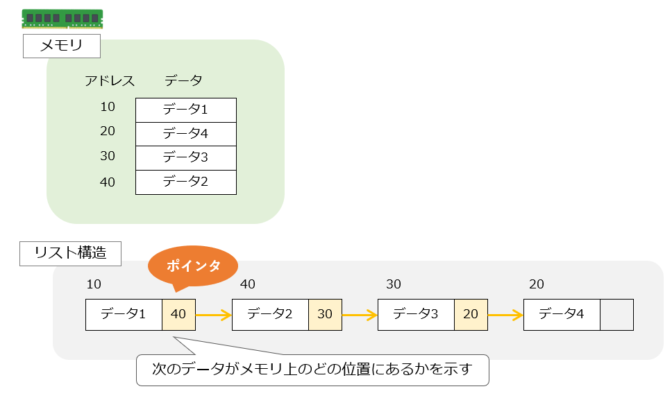
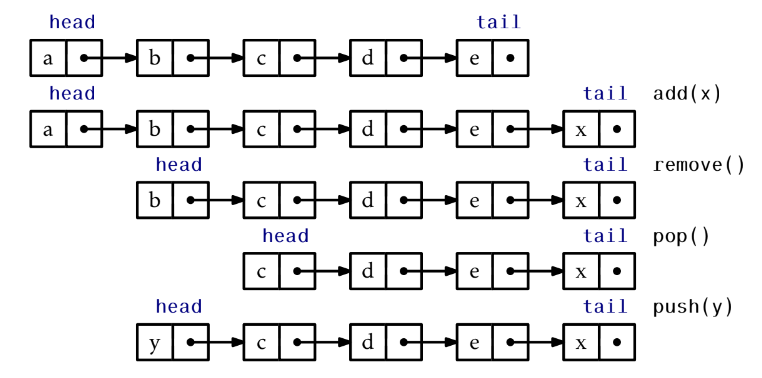
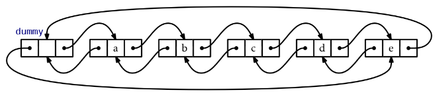
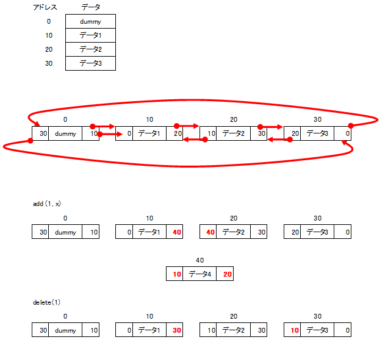

# 3. 連結リスト
- リストの実装（配列ではなく、ポインタを使う）
  
- 連結リストの種類  
  - SLList（単方向連結リスト）
  - DLList（双方向連結リスト）
  - （循環連結リスト）
- 連結リストの短所と長所
  - `get(i)`, `set(i, x)`が定数時間ではない
  - リストのノードへの参照uがあれば、`add`, `remove`が定数時間で実行できる
  
|           |get(i)/set(i,x)      |add(i, x)/remove(i) |
|:----------|:--------------------|:-------------------|
|ArrayStack |O(1)                 |O(1 + n -1)         |
|ArrayDeque |O(1)                 |(1 + min{i, n - i}) |
|DLList     |O(1 + min{i, n - i}) |(1 + min{i, n - i}) |

## 3.1 SLList: 単方向連結リスト
### SLListの構造
SLListとは、ノードからなる列
- Node u
  - **u.x**: 値
  - **u.next**: 次のノードの参照

- SEListが保持する変数
  - **head**: 先頭のノード
  - **tail**: 末尾のノード
  - **n**: 列の長さ  
  
  ただし、要素が空のとき、head = null, tail = nullとする。  
### SLListを用いたQueue操作

- `push(x)`: 先頭に要素を追加
  - 新しいノードuを作る（u.x = x, u.next = head)
  - 新しいノードuを先頭に設定する（head = u）
  - n++
- `pop()`: 先頭の要素を削除
  - 2つめのノードを先頭にすることで先頭を削除（head = head.next）
  - n--
- `add(x)`: 末尾に要素を追加
  - 新しいノードuを作る（u.x = x)
  - 追加前の末尾の参照をuにする（tail.next = u）
  - n++
- `remove()`: 先頭の要素を削除
  - `pop()`と同じ  
  
※ ただし、pop(), remove()の結果n=0になる場合や、n=0でpush(x), remove(x)をする場合は特別な処理が必要  
※ 末尾の要素を、効率的に削除できないためDequeの実装にはDLListを用いる。  

## 3.2 DLList: 双方向連結リスト
### DLListの構造
DLListとは、ノードからなる列（ノードの構造がSLListが異なる点が主な違い）
- Node u
  - u.x: 値
  - **u.prev: 前のノードの参照**（←new!）
  - u.next: 次のノードの参照

- DLListが保持する変数
  - ~~**head**: 先頭のノード~~
  - ~~**tail**: 末尾のノード~~
  - dummy: リストの先頭の直前にあり、リストの末尾の直後にある空のノード
  - **n**: 列の長さ  

  
  
  ただし、要素が空のとき、head = null, tail = nullとする。  
### i番目のノードの参照方法
- dummyを起点として、ノードを順に辿っていく。  
- 実行時間はO(1 + min{i, n-i})
```cpp
Node* getNode(int i) {
  Node* p;
  if (i < n / 2) {
    p = dummy.next;
    for (int j = 0; j < i; j++)
      p = p->next;
  } else {
    p = &dummy;
    for (int j = n; j > i; j--)
      p = p->prev;
  }
  return (p);
}
```

### get(i), set(i,x)
- i番目を見つけて、値を返す。
- 実行時間はO(1 + min{i, n-i})
```cpp
T get(int i) {
  return getNode(i)->x;
}

T set(int i, T x) {
  Node* u = getNode(i);
  T y = u->x;
  u->x = x;
  return y;
}
```

### add(i, x）, remove(i)
- add(i, x)
  - i番目のノードを見つけ、その直前に、データxを持つ新しいノードを追加
  - 実行時間はO(1 + min{i, n-i})
  ```cpp
  Node* addBefore(Node *w, T x) {
    Node *u = new Node;
    u->x = x;
    u->prev = w->prev; // 図の「10」
    u->next = w;       // 図の「20」
    u->next->prev = u; // 図の「40」
    u->prev->next = u; // 図の「40」
    n++;
    return u;
  }

  void add(int i, T x) {
    addBefore(getNode(i), x); // i番目の要素を見つけ、その1つ前にノードを追加
  }
  ```
- delete(i)
  - i番目のノードを見つけて削除
  - 実行時間はO(1 + min{i, n-i})
  ```cpp
  void remove(Node *w) {
    w->prev->next = w->next; // 1つ前のノードの.nextを書き換え
    w->next->prev = w->prev; // 1つ後のノードの.prevを書き換え
    delete w;
    n--;
  }

  T remove(int i) {
    Node *w = getNode(i);
    T x = w->x;
    remove(w);
    return x;
  }
  ```


### DLListの長所
- i番目のノードを見つける操作（getNode(i)）を無視すると、set, get, add, removeが定数時間
- 別の方法でノードの参照が得られるアプリケーションに適している。

## 3.3 SEList