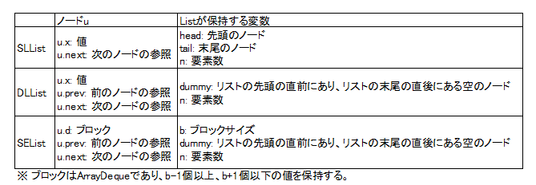
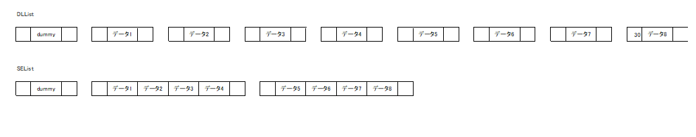
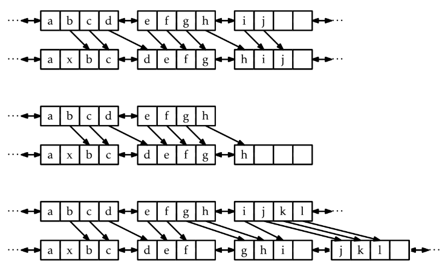
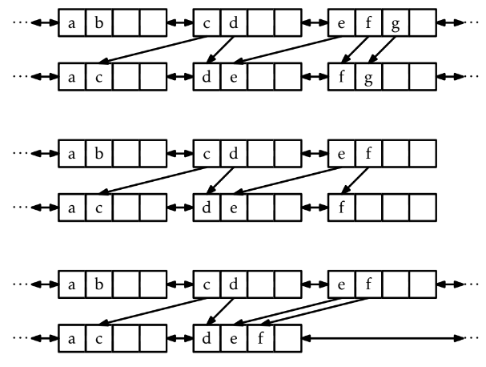

# 3. 連結リスト
- 連結リストとは
  - リストの実装である
  - ノードからなる列である
  - ノードが、列の前後のノードの参照（ポインタ）を保持する
    
- 連結リストの短所と長所
  - `get(i)`, `set(i, x)`が定数時間ではない
  - リストのノードへの参照uがあれば、`add`, `remove`が定数時間で実行できる
  
  |           |get(i)/set(i,x)        |add(i, x)/remove(i)   |
  |:----------|:----------------------|:---------------------|
  |ArrayStack |O(1)                   |O(1 + n -1)           |
  |ArrayDeque |O(1)                   |(1 + min{i, n - i})   |
  |DLList     |O(1 + min{i, n - i})   |(1 + min{i, n - i})   |
  |SEList     |O(1 + min{i, n - i}/b) |(b + min{i, n - i}/b) |
- 実装する各連結リストの比較
  
  

## 3.1 SLList: 単方向連結リスト
### SLListの構造
SLListとは、ノードからなる列
- Node u
  - **u.x**: 値
  - **u.next**: 次のノードの参照

- SEListが保持する変数
  - **head**: 先頭のノード
  - **tail**: 末尾のノード
  - **n**: 列の長さ  
  
  ただし、要素が空のとき、head = null, tail = nullとする。  
### SLListを用いたQueue操作

- `push(x)`: 先頭に要素を追加
  - 新しいノードuを作る（u.x = x, u.next = head)
  - 新しいノードuを先頭に設定する（head = u）
  - n++
- `pop()`: 先頭の要素を削除
  - 2つめのノードを先頭にすることで先頭を削除（head = head.next）
  - n--
- `add(x)`: 末尾に要素を追加
  - 新しいノードuを作る（u.x = x)
  - 追加前の末尾の参照をuにする（tail.next = u）
  - n++
- `remove()`: 先頭の要素を削除
  - `pop()`と同じ  
  
※ ただし、pop(), remove()の結果n=0になる場合や、n=0でpush(x), remove(x)をする場合は特別な処理が必要  
※ 末尾の要素を、効率的に削除できないためDequeの実装にはDLListを用いる。  

## 3.2 DLList: 双方向連結リスト
### DLListの構造
DLListとは、ノードからなる列（ノードの構造がSLListが異なる点が主な違い）
- Node u
  - u.x: 値
  - **u.prev: 前のノードの参照**（←new!）
  - u.next: 次のノードの参照

- DLListが保持する変数
  - ~~**head**: 先頭のノード~~
  - ~~**tail**: 末尾のノード~~
  - dummy: リストの先頭の直前にあり、リストの末尾の直後にある空のノード
  - **n**: 列の長さ  

  
  
  ただし、要素が空のとき、head = null, tail = nullとする。  
### i番目のノードの参照方法
- dummyを起点として、ノードを順に辿っていく。  
- 実行時間はO(1 + min{i, n-i})
```cpp
Node* getNode(int i) {
  Node* p;
  if (i < n / 2) {
    p = dummy.next;
    for (int j = 0; j < i; j++)
      p = p->next;
  } else {
    p = &dummy;
    for (int j = n; j > i; j--)
      p = p->prev;
  }
  return (p);
}
```

### get(i), set(i,x)
- i番目を見つけて、値を返す。
- 実行時間はO(1 + min{i, n-i})
```cpp
T get(int i) {
  return getNode(i)->x;
}

T set(int i, T x) {
  Node* u = getNode(i);
  T y = u->x;
  u->x = x;
  return y;
}
```

### add(i, x）, remove(i)
- add(i, x)
  - i番目のノードを見つけ、その直前に、データxを持つ新しいノードを追加
  - 実行時間はO(1 + min{i, n-i})
  ```cpp
  Node* addBefore(Node *w, T x) {
    Node *u = new Node;
    u->x = x;
    u->prev = w->prev; // 図の「10」
    u->next = w;       // 図の「20」
    u->next->prev = u; // 図の「40」
    u->prev->next = u; // 図の「40」
    n++;
    return u;
  }

  void add(int i, T x) {
    addBefore(getNode(i), x); // i番目の要素を見つけ、その1つ前にノードを追加
  }
  ```
- delete(i)
  - i番目のノードを見つけて削除
  - 実行時間はO(1 + min{i, n-i})
  ```cpp
  void remove(Node *w) {
    w->prev->next = w->next; // 1つ前のノードの.nextを書き換え
    w->next->prev = w->prev; // 1つ後のノードの.prevを書き換え
    delete w;
    n--;
  }

  T remove(int i) {
    Node *w = getNode(i);
    T x = w->x;
    remove(w);
    return x;
  }
  ```


### DLListの長所
- i番目のノードを見つける操作（getNode(i)）を無視すると、set, get, add, removeが定数時間
- 別の方法でノードの参照が得られるアプリケーションに適している。

## 3.3 SEList
- Node u
  - u.d: ブロック
  - u.prev: 前の参照
  - u.next: 次の参照

- SEListが保持する変数
  - b: ブロックサイズ
  - dummy: リストの先頭の直前にあり、リストの末尾の直後にある空のノード
  - **n**: 列の長さ  

- SEListにおける成約
  - 各ノードのブロックの要素数はb-1以上、b+1以下
  


### 3.3.1 必要なメモリ量
各ブロックの要素数はb-1以上、b+1以下なので、ブロックの数は最大でも
```
n / (b - 1) + 1 = O(n/b)
```
各ブロック内の無駄な領域は定数なので、無駄な領域は
```
O(b + n/b) // 最初のbは、末尾のブロックの空の要素分
```

### 3.3.2 要素を検索
- 要素の位置は次の2つから決まる
  1. i 番めの要素を含むブロックをデータとして持つノード u
  2. そのブロックの中の要素の添字 j

- 要素の検索
  - dummyから順方向、もしくは逆方向に探していく点はDLListと同様
  - ブロックごとにスキップしながら、探索できる点が異なる。
  - 実行時間は、O(1 + min{i, n - i}/b)
  ```cpp
  void getLocation(int i, Location &ell) {
    if (i < n / 2) {
      Node *u = dummy.next;
      while (i >= u->d.size()) {
        i -= u->d.size();
        u = u->next;
      }
    ell.u = u;
    ell.j = i;
  } else {
      Node *u = &dummy;
      int idx = n;
      while (i < idx) {
        u = u->prev;
        idx -= u->d.size();
      }
      ell.u = u;
      ell.j = i - idx;
    }
  }
  ```

### 3.3.3 要素の追加
addしようとしたときに、ブロックの要素数がb+1以上になるケースでの操作が複雑。  
add(i, x)実行時の条件分岐  
- i番目の要素が入るノードuのブロックに空きが**ある**とき  
  →要素が入るノードのブロックにiを挿入
- i番目の要素が入るノードuのブロックに空きが**ない**とき  
  →uの後ろのノードを順に調べ、xを入れる余地があるノードを探索する。
  - ケース1: すぐ(r + 1 ≤ b ステップ以内)に、一杯でないブロックを持つノードが見つかる。
  - ケース2: すぐ(r + 1 ≤ b ステップ以内)に、ブロックのリストの末尾に到達する。
  - ケース3: b ステップ探しても空きがあるブロックが見つからない。
  
  

- 実行時間
  - ケース1, ケース2は, bブロックにわたって要素を探してシフトするのでO(b)
  - ケース3は, spread(u)を呼び出してb(b+1)個の要素を動かすので、O(b^2)
  - ケース3は、多くともb回につき1回しか発生ないため償却実行時間はO(b)

### 3.3.4 要素の削除
deleteしようとしたときに、ブロックの要素数がb-1以下になるケースでの操作が複雑。  
delete(i)実行時の条件分岐  
- i番目の要素があるノードuのブロックの要素数がb以上のとき
  →i番目の要素を削除
- i番目の要素があるノードuのブロックの要素数がb-1のとき
  →uの後ろのノードを順に調べ、要素を持ってくるノードを見つける。
  - ケース1: すぐ(r + 1 ≤ b ステップ以内)に、b − 1 より多くの要素を含むノードが見つかる
  - ケース2: すぐ(r + 1 ≤ b ステップ以内)に、リストの末尾に到達する。
  - ケース3: b ステップの間に b − 1 個より多くの要素を含むブロックが見つからない。
  
  
- 実行時間
  - ケース1, ケース2は, bブロックにわたって要素を探してシフトするのでO(b)
  - ケース3は, gather(u)を呼び出してb(b+1)個の要素を動かすので、O(b^2)
  - ケース3は、多くともb回につき1回しか発生ないため償却実行時間はO(b)

### spreadとgather
- spread(u)
  ```cpp
  void spread(Node *u) {
    Node *w = u;
    // 新しい空のブロックの追加位置を取得
    for (int j = 0; j < b; j++) {
      w = w->next;
    }
    w = addBefore(w); // 新しい空のブロックを追加
    // ブロック内の要素数がb-1になるよう各ブロックの要素を移動
    while (w != u) {
      while (w->d.size() < b)
        w->d.add(0, w->prev->d.remove(w->prev->d.size()-1));
      w = w->prev;
    }
  }
  ```

- gather(u)
  ```cpp
  void gather(Node *u) {
    Node *w = u;
    for (int j = 0; j < b-1; j++) {
      //要素数がb-1になるように各ブロックの要素を移動
      while (w->d.size() < b) 
        w->d.add(w->next->d.remove(0));
      w = w->next;
    }
    remove(w);
  }
  ```

- 実行時間
  - 2重ループにおいて、内側と外側のループで最大b+1実行されるのでO((b+1)^2) = O(b^2)
  - add(i, x)およびremove(i)の呼び出しb回につき1回しか呼ばれない。


