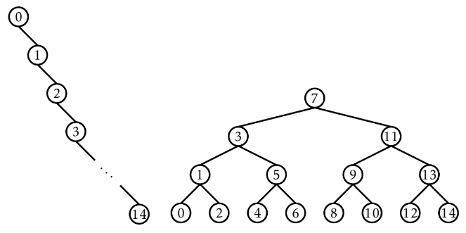
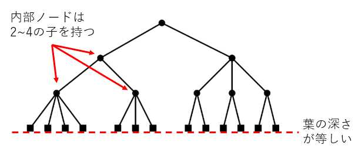
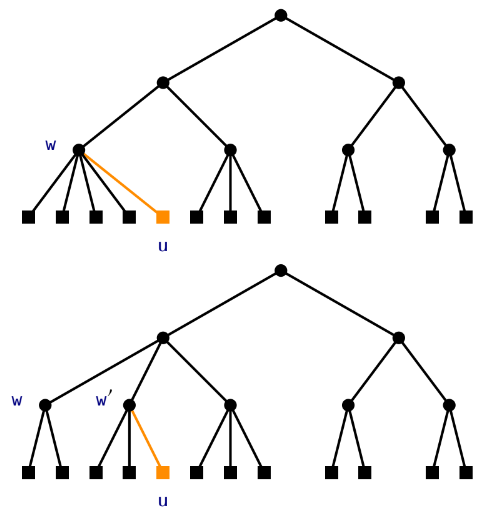
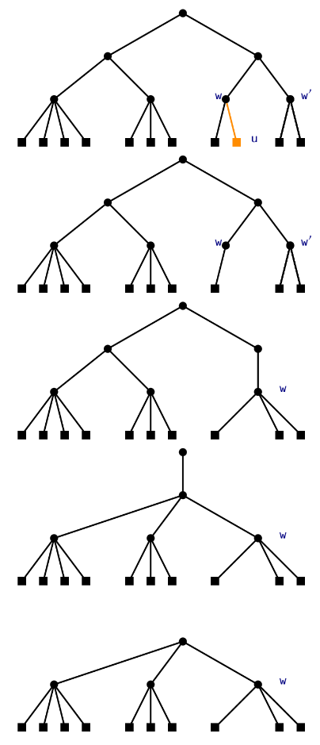
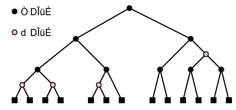
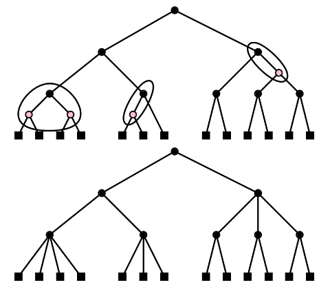
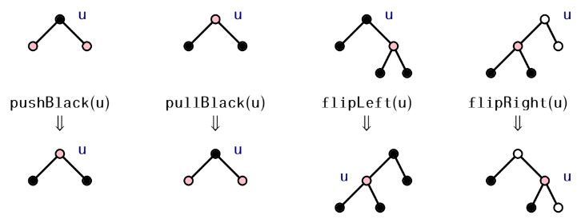
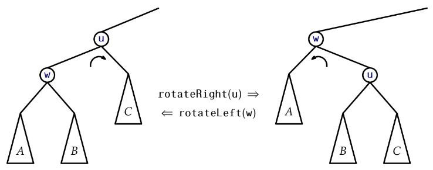
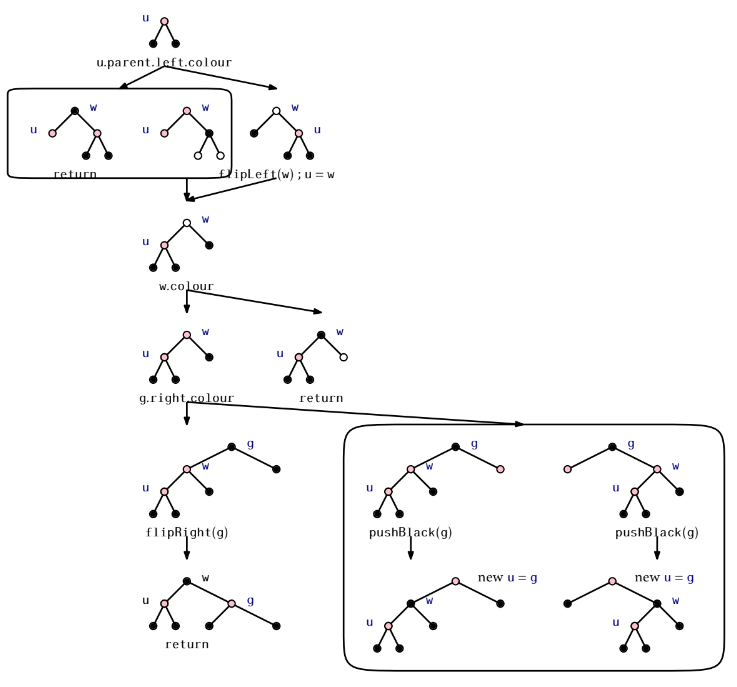

# 9. 赤黒木

# 9.0 これまでの復習
## 二分探索木
- SSetインターフェースの実装
- add(x), remove(x), find(x)の実行時間はO(n)
- いずれの操作も、根から特定のノードへの経路をたどる処理を行う

## SSetインターフェース
- 集合（set）のようなもの。n個の互いに異なる要素が含まれる。
- 要素どうしは大小比較でき、順序付けされている。
### SSetインターフェースの操作
- **size()**: 集合の要素数nを返す。
- **add(x)**: 要素xが集合に入っていなければ集合に追加する。xが追加されたらtrue, そうでなければfalseを返す。
- **remove(x)**: 集合からxを削除する。yが見つかればyを返し、見つからなければnullを返す。
- **find(x)**: y ≥ xを満たす最小の要素yを見つける。そのようなyが存在すればそれを返し、存在しないなら null を返す。

## 二分探索木の性能の向上
二分探索木にadd, deleteの操作を行うとアンバランスになる。  
  
二分探索木がアンバランスになることを回避する方法を適用する。  
- 7章 ランダム二分探索木
  - ランダム性を利用する。
  - addの際に、ノードの左にだけ追加したり、右にだけ追加したりするとアンバランスになるので、ランダム化する。
- 8章 スケープゴート木
  - 部分的な再構築を利用する。
  - アンバランスな部分木が発生したら、バランスよく再構築する。
- 9章 赤黒木

## 赤黒木の概要
- 利点（ランダム二分探索木やスケープゴート木より性能がいい）
  1. n個の要素を含む赤黒木の高さが2logn以下になる
  2. add(x) および remove(x) を最悪の場合でも O(logn) の時間で実行できる
  3. add(x) および remove(x) における回転の回数は、償却すると定数である
- 欠点  
  実装が複雑

## 9.1 背景知識: 2-4木
- 全ての葉の深さは等しい
- 全ての内部ノードは2個以上4個以下の子ノードを持つ

### 葉の追加

### 葉の削除
1. 葉uを削除する。  
1.1 葉uの親wの子が2つ以上のとき  
  → 操作終了  
1.1 葉uの親wの子が1つのとき  
  → 2.へ  
2. wの兄弟、w'の子の数を調べる  
2.1 w'の子が3つまたは4つ  
  → w'の子を1つ、wの子に移す
2.2 w'の子が2つ
  → w'の子をwの子とし、w'をw'の親から取り除く。
3. 以上の処理を、自分自身もしくは兄弟が子を3つ以上持つようなノードuが見つかるか、根に到達したら終了。  
  

## 9.2 RedBlackTree: 2-4木をシミュレートする二分木
各ノードuが赤か黒の色を持つ二分探索木（赤ノード: 0, 黒ノード: 1）  
- 葉から根への経路には、いずれも黒ノードが同じ数だけ含まれる。  
- 赤の辺はない。すなわち、赤ノード同士は隣接しない。  

### 9.2.1 赤黒木と2-4木
任意の赤黒木には、対応する2-4木が存在する。
#### 赤黒木から2-4木への変換方法
すべての赤ノードuを取り除き、uの2つの子を両方ともuの親(黒ノード)に直接接続する。

#### 赤黒木の深さについて、教科書参照
高さ: 2logn

赤黒木の性質を保つように、add, removeを実装すれば高さが2lognになる。
-> O(logn)で、add, remove, findできる。

### 9.2.2 左傾赤黒木
任意のノードuについて、u.leftが黒ならばu.rightも黒  
教科書で実装する赤黒木は左傾赤黒木。
なぜ、左傾赤黒木？
→ add, removeするときの場合分けが簡単になる。

2-4木の次数が2のノード: 黒ノード、黒い子を2つ  
2-4木の次数が3のノード: 黒ノード、左の子が赤、右の子が黒  
2-4木の次数が4のノード: 黒ノード、赤い子が2つ  

#### add, removeのサブルーチン
- **pushBlack(u)**: uを赤, uの子を黒に塗り替える
- **pllBlack(u)**: uを黒, uの子を赤に塗り替える
- **flipLeft(u)**: uとu.rightの色を入れ替え、その後uを左回転する。
- **flipRight(u)**: uとu.rightの色を入れ替え、その後uを右回転する。

#### 左回転、右回転について
- **回転**: 二分探索木の性質を保ちながら、親子関係を逆転する操作。
  
  

### 9.2.3 要素の追加
手順
1. u.x = x かつ u.colour = red を満たす葉uを追加する。
2. 左傾性、「赤の辺の性質」が満たされない場合は、addFixup(u)を呼び出して、それらを満たすようにする。  
  

? なんで追加するノードに、黒の子がついてる？
? insertFixup(), addFixupの間違い？

### 9.2.4 要素の削除
概要
1. 二分探索木の削除を行う。
2. 黒のノードwを消すと、「黒の高さの性質」が満たされなくなるため、wと入れ替えるuについて u.colour += w.colour とする
3. u.colour = 2 （ダブルブラック）となるケースがあるのでremoveFixupでダブルブラックを消す
4. 「赤の辺の性質」を満たしてない箇所を修正する。
